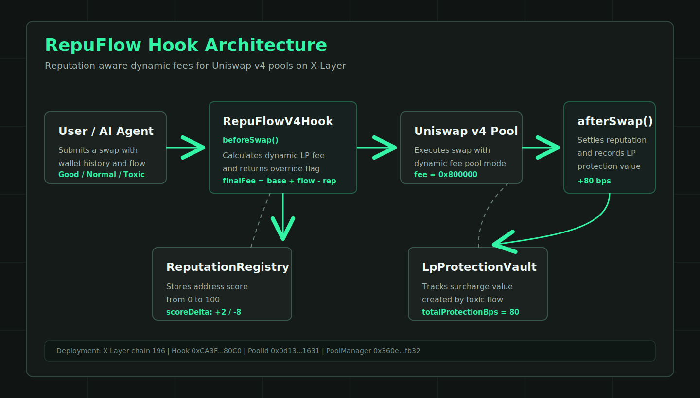
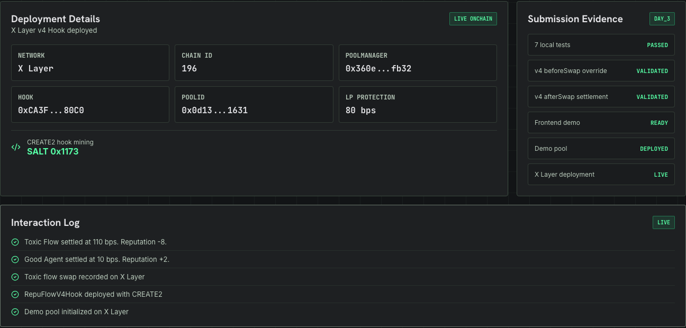
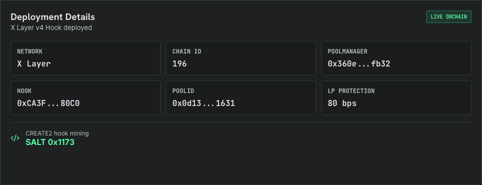
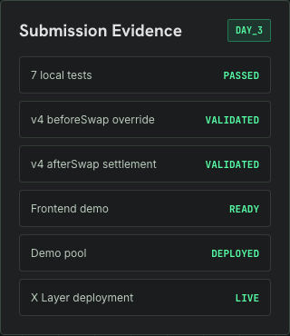

# RepuFlow Hook 白皮书

版本：v0.1  
日期：2026-05-26  
项目：RepuFlow Hook  
链：X Layer  
核心协议：Uniswap v4 Hooks



## 摘要

RepuFlow Hook 是一个面向 Uniswap v4 动态费率池的信誉感知 Hook。它让同一个池子可以根据交易流质量和交易者或 AI Agent 的历史行为，在每次 swap 执行前动态调整 LP fee。

核心目标很直接：

- 优质 Agent 获得更低执行成本。
- 普通交易者保持基础费率。
- 有毒流量支付更高费用，并将额外费率记录为 LP protection value。
- 每次 swap 后更新链上 reputation profile，让执行质量可以持续积累。

RepuFlow 当前已经在 X Layer 完成 Hook、Registry、Vault、动态费率 V4 Pool 和 demo swap 部署，前端 demo 已发布到 Cloudflare Pages。

前端 demo：

https://repuflow-hook.pages.dev

GitHub：

https://github.com/wesley442/repuflow-hook

## 1. 背景

DeFi AMM 的一个长期问题是：池子通常以同一套静态费率对待所有流量。但实际交易流并不相同。

一类流量可能改善池子状态，例如帮助池子重新接近平衡、行为稳定、长期不会持续伤害 LP。另一类流量可能不断单边冲击池子、在短窗口内提取 LP 价值，给流动性提供者带来更高风险。

随着 AI Agent 和自动化交易系统进入链上市场，这个问题会变得更明显。Agent 可以高频执行、持续交互、跨池寻找机会。如果协议无法识别历史行为，池子就只能把每个地址都当作未知流量处理。

RepuFlow 的判断是：未来的链上执行不应该只基于单笔交易，也应该基于持续行为。

## 2. 问题定义

传统 AMM fee model 存在三个限制：

1. 静态费率不能区分流量质量。
2. 交易者历史行为无法沉淀为可复用的执行信誉。
3. LP 很难直接看到有毒流量带来的额外补偿。

这会造成两个结果：

- 对 LP 来说，有毒流量带来的损耗没有被充分定价。
- 对优质 Agent 来说，长期良好执行行为没有形成经济激励。

RepuFlow 试图解决的不是“预测市场方向”，而是在 swap 执行时为不同流量提供更合理的交易成本。

## 3. 方案概览

RepuFlow 使用 Uniswap v4 Hook 接入 swap 生命周期：

```text
User / Agent
  -> submit swap
  -> RepuFlowV4Hook.beforeSwap
  -> calculate dynamic LP fee
  -> Uniswap v4 Pool executes swap
  -> RepuFlowV4Hook.afterSwap
  -> update reputation
  -> record LP protection surcharge
```

系统由三个核心合约组成：

| 模块 | 作用 |
| --- | --- |
| `RepuFlowV4Hook` | 接入 Uniswap v4 `beforeSwap` 和 `afterSwap`，执行动态费率和结算逻辑。 |
| `ReputationRegistry` | 记录交易者或 Agent 的信誉分，范围 0 到 100。 |
| `LpProtectionVault` | 记录有毒流量支付的额外 LP protection value。 |

另外项目保留 `RepuFlowHook` demo facade，用于本地算法测试和快速展示。

## 4. Hook 机制

### 4.1 beforeSwap：动态费率覆盖

`beforeSwap` 在 swap 执行前运行。RepuFlow 会读取当前交易者的 reputation score，并结合输入的 flow quality 信号计算最终费率。

MVP 公式：

```text
finalFee = baseFee + flowAdjustment - reputationDiscount
finalFee = clamp(finalFee, minFee, maxFee)
```

默认参数：

| 参数 | 值 |
| --- | ---: |
| minFee | 5 bps |
| baseFee | 30 bps |
| maxFee | 150 bps |

Uniswap v4 的 LP fee 使用 hundredths of a bip。RepuFlow 内部用 bps 方便展示，然后在返回前转换：

```text
v4Fee = finalFeeBps * 100 | LPFeeLibrary.OVERRIDE_FEE_FLAG
```

### 4.2 afterSwap：信誉和 LP protection 结算

`afterSwap` 在 swap 执行后运行，用于完成两件事：

- 根据本次流量质量更新交易者 reputation score。
- 如果最终费率高于基础费率，将 surcharge 记录为 LP protection value。

MVP 记账方式：

```text
protectionValue += max(finalFee - baseFee, 0)
```

这让 LP 保护不只是一个概念，而是可以在前端和部署记录中看到的状态。



## 5. 流量分类与信誉分

MVP 使用确定性的演示规则，而不是复杂的链下模型。这样评审和开发者可以直接复现结果。

| 流量类型 | 信誉区间 | 典型行为 | 费率结果 |
| --- | ---: | --- | --- |
| Good Agent | 80-100 | 有助于池子平衡，历史行为稳定 | 低于基础费率 |
| Normal Trader | 40-79 | 普通交易，没有明显正负影响 | 基础费率附近 |
| Toxic Flow | 0-39 | 大额单边冲击，短窗口高影响 | 高于基础费率 |

Demo 中的三类 profile：

- Good Agent：高信誉、平衡改善流量，获得折扣。
- Normal Trader：普通交易者，支付基础费率。
- Toxic Flow：高冲击单边流量，支付 surcharge。

## 6. LP Protection 模型

RepuFlow 不把 surcharge 设计成隐藏成本，而是把它作为 LP protection accounting 显示出来。

在当前链上 demo 中，toxic flow 执行后记录：

```text
totalProtectionBps = 80
```

这表示 toxic flow 相对基础费率贡献了额外 LP protection 价值。对评审和 LP 来说，这个指标能直接说明 Hook 不是只给交易者定价，也在显式表达 LP 的风险补偿。



## 7. 链上部署

当前部署网络：

| 项目 | 值 |
| --- | --- |
| Network | X Layer |
| Chain ID | 196 |
| RPC | `https://rpc.xlayer.tech` |
| Uniswap v4 PoolManager | `0x360e68faccca8ca495c1b759fd9eee466db9fb32` |

核心合约：

| 合约 | 地址 |
| --- | --- |
| RepuFlowV4Hook | `0xCA3F1a914C3DBddC18754Be684c0A982838980C0` |
| ReputationRegistry | `0x8C235BBb0468c26a45C34C627cB70ad9a6072982` |
| LpProtectionVault | `0x7C19c7cE8810f7af82e3852E6435159996Ba98a0` |
| DemoPoolOperator | `0x6e0F7C563C3aDc3f9D682570549a7Bb3a8C443D1` |
| Mock OKB | `0x0264f0C02201F512C012D812309f23093311Fe0B` |
| Mock USD | `0x3AA351f84B6f76ED14463F32f97fA22ECB2613Fd` |
| V4 Pool / PoolId | `0x0d136c98265159561baef57aa8c312a29ae12c97edc10eb97fb14a023ada1631` |

Hook 地址挖矿：

| 项目 | 值 |
| --- | --- |
| Required flags | `beforeSwap | afterSwap` |
| Required flag value | `0x00c0` |
| CREATE2 deployer | `0x4e59b44847b379578588920cA78FbF26c0B4956C` |
| Salt | `0x0000000000000000000000000000000000000000000000000000000000001173` |
| Init code hash | `0x4de5e1fe32ca87cdd81ed9315295e6c7a94d8f217d3fa0b9cf65a36df83bc232` |

## 8. Demo 交易

| 动作 | Transaction Hash |
| --- | --- |
| RepuFlowV4Hook CREATE2 deployment | `0x3b6cef634bbff32e884a120063b11d3a8af793a5154905a7220c4094dfa44c7e` |
| Registry setScoreWriter | `0x112a6bcd2761eb69d9a7d7178379f6b0a685619dde4f34c2b3569ca2f7fea5bd` |
| Vault setRecorder | `0xcf9340cd37e94e799017e612f21c4916cafeb89a1894bc1f9273f01c85470a45` |
| Pool initialize | `0xdb85fcf0e60bb61a824cc705d9b80037c22175ef6cb5bb17a6cba70e86994b47` |
| Add liquidity | `0x3af81d54e0f14f7a88639430f378cf19c87ed27f31fa3051c9111376ab2a6e40` |
| Normal trader swap | `0x959369b5dc76071abd6c46de400e932fe8b3f6c355aab578f2669738a7b9745f` |
| Good agent swap | `0x6e5d75614fc01bccda73e42630a5a3d5922a087e58f6f6cb17b505e98bd14398` |
| Toxic flow swap | `0x485e9480935041e5d6ca3f22faf50993f4ecf14bea3a3cea876e82986e2f0d79` |



## 9. 前端与用户体验

RepuFlow 的前端不是交易所完整替代品，而是一个用于展示 Hook 行为的 execution terminal。它强调三点：

- 不同 profile 触发不同 fee quote。
- Demo swap 后 reputation 和 LP protection 状态立即变化。
- 链上部署证据和 demo 交易可以被提交材料直接引用。

前端已部署：

```text
https://repuflow-hook.pages.dev
```

Demo 视频：

```text
demo-output/repuflow-demo.mp4
```

## 10. 为什么适合 X Layer

X Layer 适合低成本、高频、应用导向的链上交互。RepuFlow 的目标用户包括 AI Agent、自动化交易者和希望降低 toxic flow 风险的 LP。

在这样的执行环境中，reputation-aware fee 有三个优势：

1. 高频交互让 reputation 可以快速形成有效信号。
2. 更低 gas 成本让 Hook 逻辑和状态更新更容易被实际使用。
3. X Layer 生态需要能展示真实应用价值的 v4 Hook，而不是只在本地模拟的合约。

## 11. 安全与限制

当前版本是黑客松 MVP，不是生产级金融系统。主要限制包括：

- Flow quality 使用确定性 demo 输入，尚未接入复杂链上风控模型。
- Reputation score 由当前 Hook 写入，未来需要更严格的治理和权限模型。
- LP protection 当前以 bps 记账展示，生产版本需要进一步定义资金流、清算和 LP 分配方式。
- 合约尚未经过第三方审计。

这些限制不会影响当前 demo 的核心结论：Uniswap v4 Hook 可以在 swap 生命周期中实现可验证的动态费率和声誉结算。

## 12. 路线图

### Phase 1：Hackathon MVP

- 完成 RepuFlowV4Hook。
- 完成 X Layer 部署。
- 完成 demo pool 和三类 swap。
- 完成前端、视频和提交材料。

### Phase 2：更真实的 reputation engine

- 增加多窗口 flow quality 评分。
- 引入池子层面的波动和库存偏移指标。
- 引入 Agent 身份和可迁移 reputation profile。

### Phase 3：LP protection 产品化

- 将 protection accounting 和实际 LP 分配机制结合。
- 提供 LP dashboard。
- 支持多个池子和多个资产对。

### Phase 4：生态集成

- 对接更多 X Layer 应用和交易入口。
- 为 AI Agent 提供 reputation SDK。
- 探索跨池、跨策略 reputation 组合。

## 13. 结论

RepuFlow Hook 展示了一种面向 Agentic DeFi 的市场结构：池子不再把所有交易都当作同质流量，而是可以根据执行质量和历史信誉动态调整费率。

这套机制同时服务三类参与者：

- LP 获得更明确的 toxic flow 风险补偿。
- 优质 Agent 获得长期执行优势。
- 协议获得可验证、可组合、可扩展的 Hook 级定价逻辑。

RepuFlow 的核心不是让费率变复杂，而是让费率更接近真实风险。

## 免责声明

本文档仅用于黑客松项目说明和技术展示，不构成投资建议、金融建议或生产部署承诺。当前合约和前端为 MVP 版本，使用前应进行完整审计、风险评估和参数治理。
